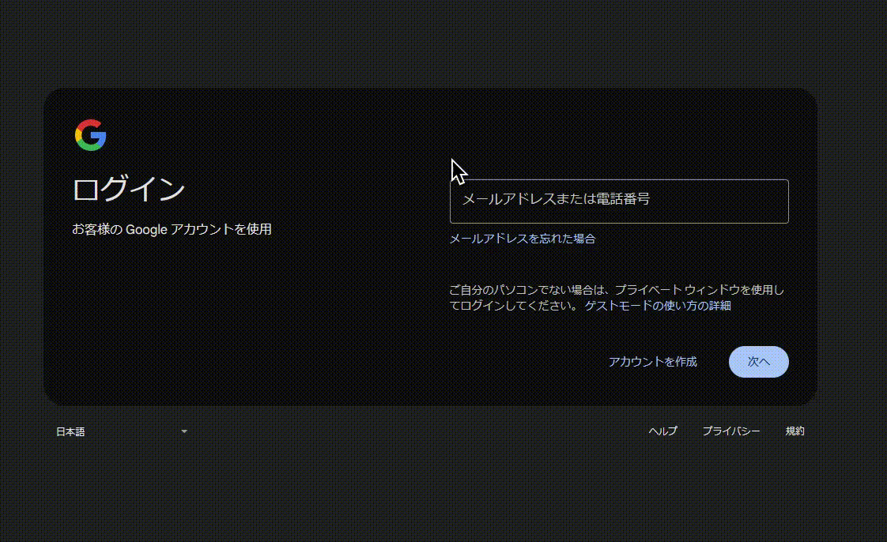
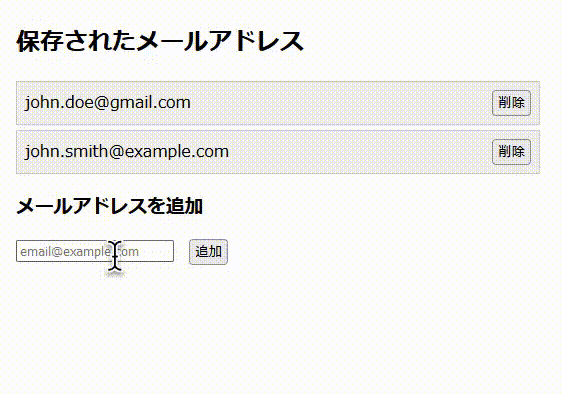
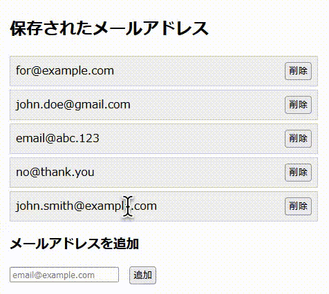

# Autofill Email address (Firefox Extension)

メールアドレスの入力を補助する拡張機能です。 
アカウント作成時などにメールアドレスの入力が必要な場合、拡張機能の設定で登録したメールアドレスが候補として、入力欄の上部にポップアップ表示されます。

Assists you in entering your email address. 
When you need to enter your email address—for example, when creating a new account—email addresses saved in the extension settings will appear as suggestions in a popup above the input field.

## 🔧 主な機能

* ✅ 複数のメールアドレスを保存・管理
* 🖱️ 入力フォームで右クリックし、登録済みアドレスを選択して自動入力
* 💾 ローカルストレージに保存されるため、プライバシーも安心
* 🧹 アドレスの編集・削除も簡単に操作可能

## 📸 使用イメージ

1. 任意のメールアドレス入力欄を右クリック
2. 登録済みアドレスを選択すると、自動的にそのアドレスが入力される

## ⚙️ メールアドレスの登録

1. アドオンのオプションを開く
2. 登録したいメールアドレスを追加する

登録したメールアドレスはオプションで並び替えが可能です。 
SortableJSを使用してます。

## 🔐 プライバシーについて

この拡張機能はメールアドレスをローカルストレージに保存しており、外部に送信することは一切ありません。

## 📄 ライセンス

[MIT License](LICENSE.md)
